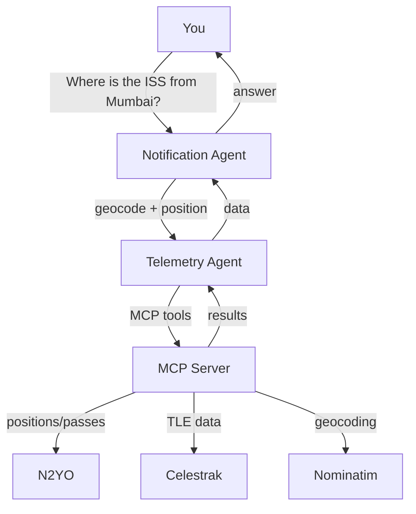

# SkyTraceAI
*A submission for the Kaggle AI Agents Capstone Project — **Freestyle Track***

Multi-agent satellite position tracking with MCP, and real-time orbital mechanics.

Ask questions in natural language — `"Where is the ISS from Mumbai?"`, `"List satellites above New York City?"`, `"How far is Hubble from London?"` — and SkyTraceAI answers with live orbital data.

---

#### The Problem & Why Agents?

Tracking satellites means juggling orbital mechanics, math, and aerospace APIs (Celestrak, N2YO). A simple question like "Where is the ISS?" has to bridge natural language with 3D ECEF coordinate math.

A multi-agent system separates those concerns cleanly:
- **Notification Agent** handles the conversation — parsing intent, geocoding places, formatting answers
- **Telemetry Agent** handles the math and tool execution — talking to the MCP server, computing distances, no natural language involved

---

## Features

- **Multi-agent AI (ADK)** — User/Notification Agent + Telemetry Agent via Google ADK orchestration
- **MCP Server** — Exclusive gateway to N2YO, Celestrak, and Nominatim; rate-limited, no direct HTTP from agents
- **Headless CLI** — Same backend available via command-line for scripting and automation
- **Security-first** — User coordinates are request-scoped only, never logged or persisted; token-bucket rate limiting; `.env` secrets
- **Orbit propagation** — SGP4 via Celestrak TLE; fallback to N2YO position/visual pass endpoints
- **Reverse geocoding** — Converts satellite lat/lon to human-readable place names via Nominatim (cached, rate-limited)
- **Distance computation** — True 3D slant range (ECEF) + ground track distance (Haversine)

---

## System Architecture



### Component Roles

| Component | Tech | Responsibility |
|-----------|------|----------------|
| **CLI** | argparse | Headless entry for scripting; connects to MCP server and runs queries |
| **User/Notification Agent** | ADK Agent | NLU, geocoding, delegates to Telemetry Agent, generates conversational responses |
| **Telemetry Agent** | ADK Agent | Orbit propagation, calls MCP tools, outputs structured numerical data only |
| **ADK Orchestrator** | SequentialAgent | Coordinates agent-to-agent calls |
| **MCP Server** | official `mcp` SDK | All external API calls, rate limiting, credential management, data privacy |
| **External APIs** | REST | N2YO (positions/passes), Celestrak (TLE), Nominatim (geocoding) |

### MCP Tools

| Tool | Source | Description |
|------|--------|-------------|
| `get_tle(norad_id)` | Celestrak | Fetch TLE data |
| `get_satellite_position(norad_id, lat, lon, alt)` | N2YO | Current position + fallback TLE propagation |
| `get_visual_passes(norad_id, lat, lon, alt, days)` | N2YO | Visual pass predictions |
| `geocode_place(place_name)` | Nominatim | Forward geocode place name → lat/lon |
| `reverse_geocode(lat, lon)` | Nominatim | Reverse geocode lat/lon → place name (cached, 1 req/sec) |
| `get_satellites_above(lat, lon, alt, radius_deg, category)` | N2YO | List all satellites overhead within a radius |

---

## Quick Start

### 1. Setup

```bash
python -m venv .venv
source .venv/bin/activate          # Linux/macOS
.venv\Scripts\activate             # Windows

pip install -e ".[dev]"
cp .env.example .env
# Add your N2YO API key (get one free at https://www.n2yo.com/api/).
# Required for: position, passes, satellites-above queries.
# Without it: only TLE lookups (Celestrak) and geocoding (Nominatim) will work.
```

### 2. Run the CLI

```bash
python -m skytrace "Where is the ISS from Mumbai?"
```

Or in interactive mode:

```bash
python -m skytrace --interactive
```

### 3. Run tests

```bash
pytest -v
```

All tests should pass.

---

## CLI Example

```bash
$ python -m skytrace "Where is the ISS from Mumbai?"

SkyTrace
========

Query: Where is the ISS from Mumbai?
--------------------------------------------------
Connecting to MCP server...

ISS is currently over open ocean, no nearby landmark (lat: -10.4189, lon: -108.8337)
Altitude: 428.957595757327 km
Distance from Mumbai, Mumbai Suburban District, Maharashtra, India: 13133.1 km (line-of-sight)
Ground track distance: 19048.5 km
Elevation: 85.5 deg (above horizon)
```

```bash
$ python -m skytrace --help

SkyTrace - Ask about satellite passes

Examples:
  python -m skytrace "Where is the ISS from Mumbai?"
  python -m skytrace "List satellites above New York City"
  python -m skytrace --interactive
```

---

## Project Structure

```
SkyTrace/
├── pyproject.toml          # Project config & dependencies
├── .env.example
├── .gitignore
├── README.md
├── src/
│   └── skytrace/
│       ├── __main__.py          # CLI entry point (python -m skytrace)
│       ├── config.py            # Pydantic settings + .env
│       ├── models/
│       │   └── __init__.py      # Pydantic data models
│       ├── agents/
│       │   ├── telemetry_agent.py
│       │   ├── user_notification_agent.py
│       │   └── orchestrator.py
│       ├── mcp_server/
│       │   ├── __init__.py
│       │   ├── main.py
│       │   └── server.py        # MCP tools with rate limiting
│       └── utils/
│           ├── __init__.py
│           ├── rate_limiter.py  # Token-bucket + sliding window
│           ├── security.py      # Request-scoped coordinates
│           └── geocoding.py     # Local location cache
└── tests/
    ├── __init__.py
    ├── test_architecture.py    # No direct HTTP outside MCP
    ├── test_mcp_integration.py # MCP client→server integration
    └── test_rate_limiter.py    # Token-bucket + sliding window
```

---

## Worked Example

**Query:** *"Where is the ISS from Mumbai?"*

1. User/Notification Agent parses the query → detects intent (`position`), satellite (`ISS`, NORAD 25544), location (`Mumbai`)
2. Geocodes via Telemetry Agent → MCP `geocode_place("Mumbai")` → `19.0760, 72.8777`
3. Calls `get_satellite_position(25544, 19.076, 72.8777, 0)` for current ISS lat/lon
4. Calls `distance` to compute slant range from observer to satellite using ECEF geometry
5. MCP Server applies rate limiting before each external API call
6. Telemetry Agent returns structured position data + computed distances
7. Notification Agent formats the response:

```
ISS is currently over open ocean, no nearby landmark (lat: -10.4189, lon: -108.8337)
Altitude: 428.96 km
Distance from Mumbai, Mumbai Suburban District, Maharashtra, India: 13133.1 km (line-of-sight)
Ground track distance: 19048.5 km
Elevation: 85.5 deg (above horizon)
```

---

### Rate Limiting & Caching

- **Rate limit:** 1 request/second (Nominatim usage policy), enforced via a dedicated token-bucket limiter
- **Cache:** In-memory cache with 5-minute TTL, keyed by coordinates rounded to ~0.01° (~1km precision)
- Same coordinate within a pass window hits the cache, avoiding repeat API calls

### Example Output

```
Query: Where is the ISS from Mumbai?
ISS is currently over open ocean, no nearby landmark (lat: -10.4189, lon: -108.8337)
Altitude: 428.96 km
Distance from Mumbai, Mumbai Suburban District, Maharashtra, India: 13133.1 km (line-of-sight)
Ground track distance: 19048.5 km
Elevation: 85.5 deg (above horizon)
```

```
Query: Where is the ISS from London?
ISS is currently over open ocean, no nearby landmark (lat: -43.4209, lon: 127.5660)
Altitude: 426.9679022210121 km
Distance from Greater London, England, United Kingdom: 12538.7 km (line-of-sight)
Ground track distance: 16054.9 km
Elevation: 71.6 deg (above horizon)
```
```
Query: List satellites above New York City?
Currently above New York, United States, 1249 satellites detected. Top results:
  • MIDAS 3 DEB — altitude 3533.7803 km
  • TIROS 4 — altitude 776.9953 km
  • THOR ABLESTAR DEB — altitude 926.5004 km
  • ANNA 1B — altitude 1086.5439 km
  • THOR AGENA B DEB — altitude 1034.4659 km
Note: visibility depends on time of day and weather conditions.
```

---

## Security & Privacy

| Control | Implementation | Guarantee |
|---------|---------------|-----------|
| Rate limiting (N2YO) | Token-bucket in MCP server | 800 req/hr cap (80% of N2YO limit) |
| Rate limiting (Nominatim) | Dedicated token-bucket | 1 req/sec compliance w/ usage policy |
| Data privacy | `SecureCoordinates` context manager | Request-scoped only, never logged/persisted |
| Credential management | `.env` via `python-dotenv` | No hardcoded secrets |
| No direct HTTP from agents | Verified by `test_architecture.py` | Only MCP server makes HTTP calls |
| Reverse geocode cache | In-memory, 5-min TTL, ~1km precision | Avoids repeat API calls |

---

## Architecture Rules

- **No direct HTTP calls** outside `mcp_server/` — enforced by test
- **Rate limiting** applied before every outbound API call
- **User coordinates** never logged, never persisted, request-scoped only
- **MCP Server** is the *exclusive* gateway — agents never call external APIs directly
